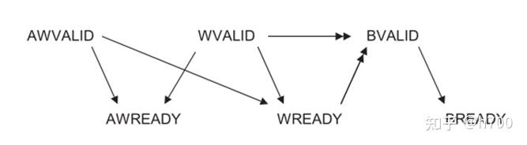
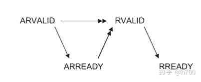

## 前言

最近需要想办法给CPU接AXI总线，目前先试着看下AXI4-LITE，IFU和ROM已经写好了，开始往LSU和RAM看看

## AXI4-lite

### 内部握手信号

**VALID**信号是传输段发送的，**READY**是接收端发送的。只有在**VALID**和**READY**同时有效的时候，信息才会被传递。**VALID**有效代表发送以准备好，**READY**有效代表接收已准备好，当其中一方有效，另一方无效时，有效的一方信号需要保持，等待另一方信号的有效。

写响应通道要发送**BVALID**和**BRESP**。其中**BVALID**要与主机发过来的**BREADY**进行握手代表写数据结束。**BRESP**为两个bit的信号，作为写数据是否成功的回应

写模式



读模式



LSU伪代码

```chisel

class AXILSU(params: AXI4Params) extends Module {
  // AXI4接口信号（简化版）
  val io = IO(new Bundle {
  //AXI信号
    ...
  // LSU控制信号（来自MEM阶段）
    ...
  })

  val sIdle :: sWriteAddr :: sWriteData :: sWriteResp :: sReadAddr :: sReadData :: Nil = Enum(6)
  val state = RegInit(sIdle)

  // 状态转换逻辑（MuxLookup风格）
  state := MuxLookup(state, sIdle)(Seq(
    // Idle 状态：检测请求并跳转到读写流程
    sIdle -> {
      when(io.req) {
        regAddr := io.addr
        Mux(io.isWrite, sWriteAddr, sReadAddr)  // 根据isWrite选择路径
      }.otherwise {
        sIdle  // 无请求时保持Idle
      }
    },

    // 写地址握手
    sWriteAddr -> Mux(io.awready, sWriteData, sWriteAddr),  // 成功则进入写数据，否则等待

    // 写数据握手
    sWriteData -> Mux(io.wready, sWriteResp, sWriteData),   // 成功则等待响应，否则等待

    // 写响应握手
    sWriteResp -> Mux(io.bvalid, { io.done := true.B; sIdle }, sWriteResp),  // 完成写操作

    // 读地址握手
    sReadAddr -> Mux(io.arready, sReadData, sReadAddr),     // 成功则等待读数据，否则等待

    // 读数据握手
    sReadData -> Mux(io.rvalid, { 
      regRData := io.rdata
      io.done := true.B
      sIdle    // 完成读操作
    }, sReadData)
  ))

  // 输出逻辑（与状态绑定）
  io.awvalid := (state === sWriteAddr)
  io.wvalid  := (state === sWriteData)
  io.bready  := (state === sWriteResp)
  io.arvalid := (state === sReadAddr)
  io.rready  := (state === sReadData)
}

```

写了一下发现上面的思路并不太对，应该在IDLE就握手达成切换下一阶段

目前的LSU就是放在MEM的上一层，如果不是访存指令就不经过LSU，直接MEM的组合逻辑通过，如果是访存指令就堵着流水线直到完成（通过MEM阶段的mem_ce_o决定是否进入状态机，是否要启用堵塞），SW4个状态，lw3个状态

### AXI RAM

下面就是verilog改写RAM了（因为要用DPI-C，规范一点还是直接黑盒写verilog，写惯chisel反而写verilog有点难受了，悲~）

现在的基本思想就是状态转换的前一个周期握手，握手成功就进行状态转换

写了一版还没有测试的，突然发现形策的PPT还没做，隔天晚上接上去测试吧。


成功了嘿嘿嘿，虽然有些疑似凑时序的操作，但还是成功跑了操作系统了，还是那句话，人和代码有一个能跑就行。


## 防止AXI死锁和活锁的官方规范

1. **`VALID` 信号独立于 `READY` 信号 
   -  **约束:** 在任何一个通道（AW, W, B, AR, R）中，**源端（Source）**，即驱动 `VALID` 和相关数据/控制信号的一方，**其 `VALID` 信号的产生不得依赖于目的端（Destination）的 `READY` 信号**。换句话说，源端必须能够在不考虑 `READY` 是否为高的情况下，将 `VALID` 拉高。
   -  **原因:** 这是防止组合逻辑环路和死锁的最基本规则。如果 `VALID` 等待 `READY`，而 `READY` 又（可能间接地）等待 `VALID`，就会形成一个永远无法解开的依赖环路，导致死锁。
   -  **Implication:** 源端一旦将 `VALID` 拉高，就必须保持 `VALID` 为高，直到目的端将 `READY` 拉高，握手在那个时钟周期完成。`VALID` 不能在 `READY` 拉高之前被撤销。
2. **`READY` 信号可以依赖于 `VALID` 信号**
   -  **约束:** **目的端**，即驱动 `READY` 信号的一方，**其 `READY` 信号的产生可以依赖于源端的 `VALID` 信号**。
   -  **原因:** 这允许目的端采取“反应式”设计。例如，一个 Slave 可以在看到 Master 发来有效的请求（`AxVALID` or `WVALID` is high）之后，才开始分配内部资源（如缓冲区）并拉高 `READY`。这不会导致死锁，因为 `VALID` 的产生不依赖 `READY`（规则 1）。
   -  **Implication:** 目的端可以在 `VALID` 为高之前就将 `READY` 拉高（表示它一直准备就绪），也可以等待 `VALID` 为高之后再拉高 `READY`。但一旦 `READY` 拉高，它必须能够**在该周期**接受数据/控制信息，如果此时 `VALID` 也为高。它不能在看到 `VALID` 为高后，在同一个周期内先拉高 `READY` 又立刻撤销（在握手完成前）。
3. **通道间的依赖关系** - 这对于防止跨通道死锁至关重要：
   -  **写通道 (AW, W, B):**
      -  **W 通道可以依赖 AW 通道:** `WVALID` （写数据有效）**可以**等待 `AWREADY` （写地址准备好）变高。也就是说，Master 可以等地址被 Slave 接受之后，再开始发送第一个写数据。这可以防止 Master 发送了数据但地址还没被接受的情况。**但是**，`WVALID` **不能** 等待 `AWVALID` 变高（这可能导致循环依赖）。依赖是基于 AW 握手的 *完成*。
      -  **AW 通道不能依赖 W 通道:** `AWVALID` （写地址有效）**不能** 依赖 `WVALID` 或 `WREADY`。Master 必须能够独立于写数据通道的状态发出写地址请求。如果地址要等数据准备好，而 Slave 需要地址来决定把数据写到哪，就会死锁。
      -  **B 通道不能依赖 AW/W 通道:** `BREADY` （Master 准备好接收写响应）**不能** 依赖 `AWVALID`, `AWREADY`, `WVALID`, 或 `WREADY`。Master 发出写请求后，必须最终能够接收写响应，不能因为后续的 AW 或 W 操作阻塞而拒绝接收 B 通道响应。
   -  **读通道 (AR, R):**
      -  **AR 通道不能依赖 R 通道:** `ARVALID` （读地址有效）**不能** 依赖 `RVALID` 或 `RREADY`。Master 必须能够独立于读数据通道的状态发出读地址请求。
      -  **R 通道可以依赖 AR 通道:** `RVALID` （读数据有效）自然是依赖于 AR 握手的完成（Slave 收到地址后才能去读数据）。
      -  **RREADY 不能依赖 AR 通道:** `RREADY` （Master 准备好接收读数据）**不能** 依赖 `ARVALID` 或 `ARREADY` *一旦 AR 握手开始或完成后*。Master 发出读请求后，必须最终能够接收读数据，不能因为新的 AR 请求阻塞而拒绝接收 R 通道数据。