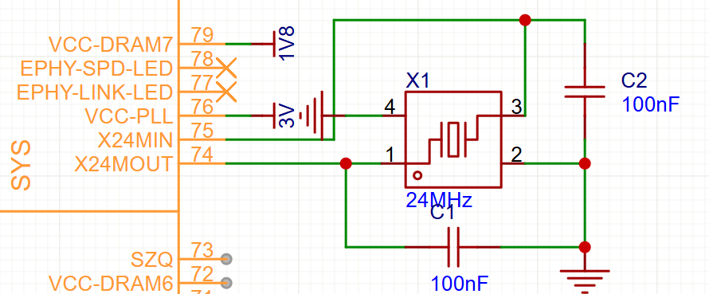
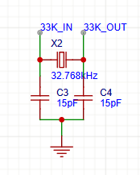

## 芯片选型

F1C200S，全志H3，全志V3s，rk3566，让AI总结的性能对比

| 参数         | F1C200S          | H3              | V3S            | RK3566            |
| :----------- | :--------------- | :-------------- | :------------- | :---------------- |
| **CPU**      | ARM9 单核@600MHz | A7 四核@1.2GHz  | A7 单核@1.2GHz | A55 四核@1.8GHz   |
| **GPU**      | 无               | Mali-400MP2     | 无             | Mali-G52 MP2      |
| **内存**     | 64MB DDR1        | 外置DDR3（2GB） | 64MB DDR2      | 外置LPDDR4（8GB） |
| **视频解码** | 1080p H.264      | 4K H.265        | 1080p H.264    | 4K H.265/VP9      |
| **显示输出** | 720p RGB         | 1080p HDMI      | 720p RGB       | 4K HDMI           |

全志H3，rk3566都需要植球，不会也没设备，全志V3s应该是现有最好的选择了

## 画PCB

晶振电路，2个15PF的寄生电容，存储和锁相环电压

32.768kHz低速晶振接口

## 参考资料与开源项目

[全志H6开发板-从零入门ARM高速电路设计 - 立创开源硬件平台](https://oshwhub.com/logicworld/h6_board)

[GitHub - Commander-bao/BlueberryPi: 造”派“计划，一起设计一块属于自己的”树莓派“吧](https://github.com/Commander-bao/BlueberryPi)