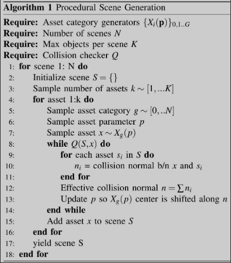
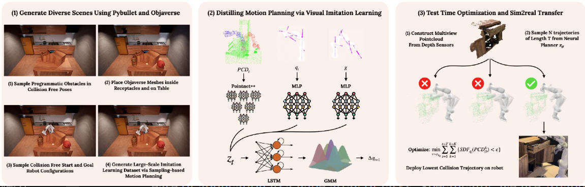

# 概述

## 论文概述

通过大规模数据驱动的学习，构建一个**通用、快速运动规划器**，能泛化到**未见过的真实世界场景**。

## 成果

提出了一种简单、可扩展的方法来训练和部署快速、通用的神经运动规划器：1) 在逼真的配置中生成具有多样化环境的大规模程序化场景，2) 用于拟合基于采样的运动规划数据的多模态序列建模，以及 3) 轻量级的测试时优化，以确保在现实世界中快速、安全和可靠的部署。

在四个不同的环境中评估了我们的方法在 64 个现实世界运动规划任务中的表现，结果表明，与基于采样的方法相比，运动规划成功率提高了 23%，与基于优化的方法相比提高了 17%，与神经运动规划方法相比提高了 79%。

    <iframe src="//player.bilibili.com/player.html?bvid=BV1Cam8YJEog&page=1" scrolling="no" border="0" frameborder="no" framespacing="0" allowfullscreen="true" style="position:absolute; height: 100%; width: 100%;"></iframe>

# 实现

## 生成大规模训练数据

### 生成大量复杂场景

-  **程序生成物体**：使用一组六个参数可变的类别——架子、小隔间、微波炉、洗碗机、开放式盒子和橱柜。这些类别代表了日常场景中机器人遇到并必须避免碰撞的大量物体。每个类别实例都是使用原始长方体对象的组合构建的，并通过定义资产的类别特定参数进行参数化。

-  **Objaverse日常物品资产**：程序化生成可以使用定义的类别创建大量场景，但机器人可能遇到的大量日常物品并不在此分布范围内，从最近提出的大规模3D对象数据集Objaverse [37]中采样的对象来扩充我们的数据集。

-  使用从场景中现有资产计算出的有效碰撞法向量来调整其位置，从而迭代地将资产添加到场景中

### 运动规划专家提供运动数据

为了确保规划器需要避开障碍物，会从**特定位置**（例如，柜子或微波炉内部）采样末端执行器姿态。然后，通*逆运动学来推导出相应的关节姿态，作为机器人的起始或目标配置。

使用自适应信息树[10] (AIT*)，通过自适应启发式算法实现快速逼近最优路径规划。（BB:查了下自适应启发式算法感觉有点像遗传算法,不怼，就是属于他们的，还有蚁群算法）

单纯地模仿规划器的输出效果不佳，AIT* 生成的规划通常会导致航路点相距甚远，从而产生较大的动作跳跃和稀疏数据覆盖，使得网络难以拟合数据（平滑对于学习性能至关重要)。为了解决这个问题，使用三次样条插值执行平滑处理，同时强制执行速度和加速度限制。

## 泛化神经网络策略

### 适用于sim2real迁移的观测空间

在观测中包含本体感受和目标信息，包括当前的关节角度qt，目标关节角度g，以及点云PCD。

**点云** 作为场景表示的自然选择。点云是是基于机器人基坐标系的3D点，因此与视角无关，并且在模拟和真实之间基本一致。，这对于Sim2Real迁移至关重要。

### 网络架构

1. **选择LSTM而非Transformer**：
   -  使用LSTM序列模型是因为它在保持与Transformer相当性能的同时，推理速度更快
   -  LSTM能处理历史信息，这对学习专家行为很有帮助
2. **输入处理**：
   -  **点云数据(PCDt)**：用PointNet++处理，会先把点云分割成机器人、障碍物、目标机器人三部分
   -  **关节状态(qt)和目标(g/gt)**：用简单的MLP网络处理
   -  把所有处理后的信息拼接成一个向量，输入给LSTM
3. **输出设计**：
   -  因为基于采样的运动规划器（如AIT*）具有多模态特性——同一场景可能产生完全不同的规划路径，所以使用**高斯混合模型(GMM)**来输出一个多模态的概率分布
   -  网络预测的是关节角度的变化量(Δqt+1)，实际执行时用 qt+1 = qt + Δqt+1 计算下一个目标位置

左：使用专家规划器在模拟中生成大规模数据；中：训练深度网络模型以执行快速反应式运动规划；右：在推理时进行测试时优化以提高性能。

## 部署神经网络规划器

### 测试优化

依赖于一个简单的模型，该模型假设障碍物不移动，并且控制器可以准确地到达目标航路点，使用初始场景点云从策略中采样 N 条轨迹，以提供障碍物表示，并使用线性前向模型估计与机器人相交的场景点数量。然后，使用机器人与场景相交最少的路径。
$$
\min_{\tau \sim \rho_{\pi_{\theta}}} \sum_{t=1}^{T} \sum_{k=1}^{K} \mathbf{1}\{SDF_{q_t}(\text{PCD}_O^k) < \epsilon\}
$$

*   $\min_{\tau \sim \rho_{\pi_{\theta}}}$：表示在**策略 $\pi_{\theta}$ 生成的轨迹分布 $\rho_{\pi_{\theta}}$ 中**，寻找使目标函数值最小的轨迹 $\tau$。这里的 $\pi_{\theta}$ 是通过线性模型描述的轨迹分布策略。
*   $\sum_{t=1}^{T}$：表示对轨迹中的所有时间步 (timestep) 进行求和，从 $t=1$ 到 $T$。$T$ 是轨迹的总时间步长。
*   $\sum_{k=1}^{K}$：表示对障碍物点云中的所有点进行求和，从 $k=1$ 到 $K$。$K$ 是障碍物点云的最大点数，这里设定为 $4096$。
*   $\mathbf{1}\{ \cdot \}$：表示**指示函数 (indicator function)**。当括号内的条件为真时，函数值为 $1$；当条件为假时，函数值为 $0$。
*   $SDF_{q_t}(\text{PCD}_O^k)$：表示**符号距离函数的值。计算在时间步 $t$ 时，机器人处于关节角度 $q_t$ 状态下，机器人表面到**障碍物点云中的第 $k$ 个点 $\text{PCD}_O^k$的最短距离。
    *   **$\text{PCD}_O^k$**：表示障碍物点云 (obstacle point-cloud) 中的第 $k$ 个点。
    *   **$SDF_{q_t}$**：表示在机器人当前关节角度 $q_t$ 下，机器人自身的符号距离函数。
*   $\epsilon$：一个小的正阈值。当 $SDF_{q_t}(\text{PCD}_O^k) < \epsilon$ 时，表示障碍物点 $\text{PCD}_O^k$ 距离机器人表面非常近，甚至发生碰撞。

