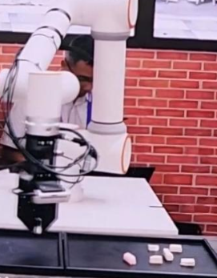
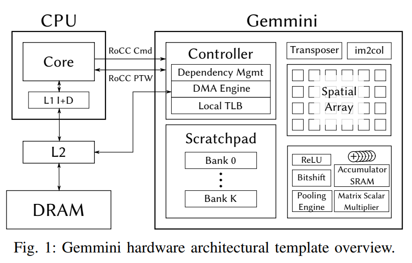
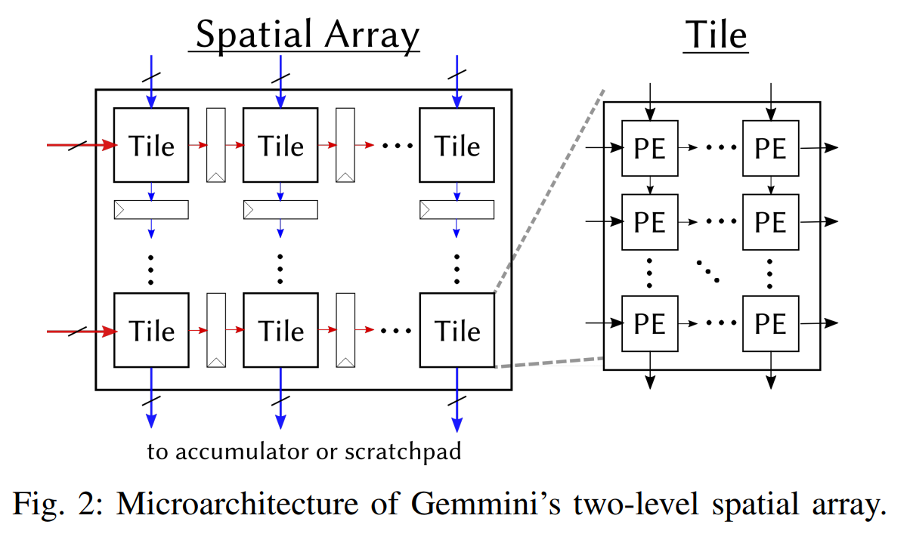
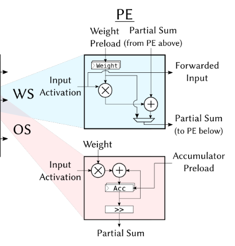
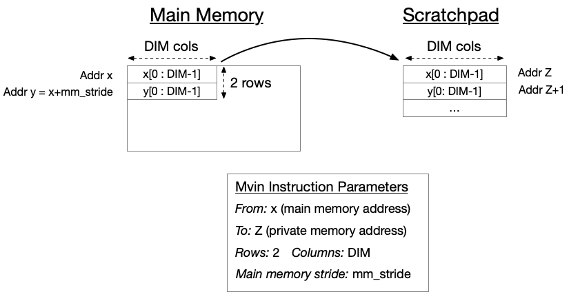

看了WAIC，感觉这个真有意思



# Gemini 扩展

### 硬件

Gemmini的空间阵列用于执行MAC操作，空间阵列由Scratchpad SRAM读取数据，并将输出结果写入Accumulator SRAM；同时还支持其他常见的DNN计算核（如非线性激活、池化等）。

脉动阵列（Systolic Array）：执行矩阵乘法

显式管理的内存：Scratchpad（输入缓存） + Accumulator（累加器）

DMA引擎：主存与私有SRAM间的数据传输

解耦访问/执行：Load/Store/Execute三控制器并行工作



Gemmini的空间阵列由Tile、PE两级架构组成，Tile通过**显式流水线寄存器**相连接；而Tile可进一步细分为PE，同一Tile中的PE**通过组合电路连接，而不使用流水线寄存器**。每个PE每个周期执行一次MAC运算，使用WS或OS的数据流形式。每个PE和每个Tile只与**其相邻的单元共享输入和输出**。





### ISA

## 数据移动指令

### mvin - 从主内存加载数据到暂存器

-  格式：`mvin rs1, rs2`
-  功能：将2D矩阵从主内存加载到Gemmini的私有内存
-  参数：
   -  rs1 = 虚拟DRAM地址(字节寻址)
   -  rs2[31:0] = 本地暂存器或累加器地址
   -  rs2[47:32] = 要加载的列数
   -  rs2[63:48] = 要加载的行数(必须≤DIM)
-  注意：
   -  实际有3个mvin指令(mvin/mvin2/mvin3)，用于同时加载A/B/D矩阵
   -  如果列数大于DIM，会加载多个子矩阵



### mvout - 从暂存器存储数据到L2/DRAM

-  格式：`mvout rs1, rs2`
-  功能：将2D矩阵从暂存器存储到主内存
-  参数：
   -  rs1 = 虚拟DRAM地址(字节寻址)
   -  rs2[31:0] = 本地暂存器地址
   -  rs2[47:32] = 要存储的列数
   -  rs2[63:48] = 要存储的行数

## 配置指令

### config_ex - 配置执行流水线

-  格式：`config_ex rs1 rs2`
-  参数：
   -  rs1[2] = 数据流模式(0=输出固定，1=权重固定)
   -  rs1[3] = 激活函数(0=无，1=ReLU)
   -  rs1[8] = 是否转置A
   -  rs1[9] = 是否转置B
   -  rs1[31:16] = A矩阵的行步长
   -  rs1[63:32] = 累加器输出缩放因子
   -  rs2[31:0] = 移位位数(用于输出固定模式)

### config_mvin - 配置加载流水线

-  格式：`config_mvin rs1 rs2`
-  参数：
   -  rs1[4:3] = 选择配置哪个mvin指令(0=mvin,1=mvin2,2=mvin3)
   -  rs1[31:16] = 暂存器内存步长
   -  rs1[63:32] = 数据加载时的缩放因子
   -  rs2 = 主内存步长(字节)

### config_mvout - 配置存储流水线

-  格式：`config_mvout rs1 rs2`
-  参数：
   -  rs2 = 主内存步长(字节)
   -  rs1包含最大池化相关参数(实验性功能)

### config_norm - 配置归一化命令

-  格式：`config_norm rs1 rs2`
-  功能：设置用于I-BERT(GELU、层归一化和softmax变体)的标量常数

### flush - 刷新TLB

-  格式：`flush rs1`
-  功能：刷新转换后备缓冲器(TLB)
-  参数：
   -  rs1[0] = 1则跳过当前TLB请求，0则重试当前请求

## 核心矩阵乘法指令

### matmul.preload - 预加载矩阵

-  格式：`matmul.preload rs1, rs2`
-  参数：
   -  rs1 = D/B矩阵地址及维度(输出固定/权重固定模式)
   -  rs2 = C矩阵地址及维度

### matmul.compute.preloaded - 计算预加载的矩阵

-  格式：`matmul.compute.preloaded rs1, rs2`
-  参数：
   -  rs1 = A矩阵地址及维度
   -  rs2 = B/D矩阵地址及维度(输出固定/权重固定模式)

### matmul.compute.accumulated - 重用先前预加载

-  格式：`matmul.compute.accumulated rs1, rs2`
-  功能：基于先前计算结果或预加载权重进行计算

## 循环指令(实验性)

### gemmini_loop_ws - 矩阵乘法循环(权重固定数据流)

-  功能：计算A*B+D=C，支持大于DIM(矩阵乘法单元的单元）xDIM的矩阵
-  特点：
   -  支持双缓冲(总数据量≤暂存器一半容量)
   -  支持外部循环平铺(ex_accumulate参数)

### gemmini_loop_conv_ws - 卷积循环(权重固定数据流)

-  功能：执行卷积运算
-  特点：
   -  支持最大池化、转置卷积等
   -  同样支持双缓冲和外部循环平铺

CISC指令实际还是由多条RISCV基础指令封装实现

```c
#define gemmini_loop_conv_ws(batch_size, in_row_dim, in_col_dim, in_channels, out_channels, out_row_dim, out_col_dim, pool_out_row_dim, pool_out_col_dim, stride, padding, kernel_dim, kernel_dilation, pool_size, pool_stride, pool_padding, batches, porows, pocols, pochs, krows, kcols, kchs, lpad, rpad, upad, dpad, plpad, prpad, pupad, pdpad, orows, ocols, weights, output, bias, input, no_bias, no_pool, downsample, wrot180, input_dilated, activation, trans_output_1203, trans_weight_1203, trans_weight_0132, trans_input_3120, max_pixels_per_row, in_stride, weight_stride, out_stride, dw, a_spad_id, b_spad_id) \
  { \
    ROCC_INSTRUCTION_RS1_RS2(XCUSTOM_ACC, ((uint64_t)(out_channels) << 48) | ((uint64_t)(in_channels) << 32) | ((uint64_t)(in_row_dim) << 16) | (uint64_t)(batch_size), \
      ((uint64_t)(padding) << 56) | ((uint64_t)(stride) << 48) | ((uint64_t)(out_col_dim) << 32) | ((uint64_t)(pool_out_row_dim) << 16) | (uint64_t)(out_row_dim), k_LOOP_CONV_WS_CONFIG_1) \
    ROCC_INSTRUCTION_RS1_RS2(XCUSTOM_ACC, ((uint64_t)(kernel_dim) << 48) | ((uint64_t)(pool_out_col_dim) << 32) | ((uint64_t)(pool_size) << 16) | ((uint64_t)(pool_stride) << 8) | (uint64_t)(pool_padding), \
      ((uint64_t)(batches) << 48) | ((uint64_t)(porows) << 32) | ((uint64_t)(pocols) << 16) | (uint64_t)(pochs), k_LOOP_CONV_WS_CONFIG_2) \
    ROCC_INSTRUCTION_RS1_RS2(XCUSTOM_ACC, ((uint64_t)(krows) << 48) | ((uint64_t)(kcols) << 32) | ((uint64_t)(kchs) << 16) | (uint64_t)(lpad), \
      ((uint64_t)(rpad) << 48) | ((uint64_t)(upad) << 32) | ((uint64_t)(dpad) << 24) | ((uint64_t)(plpad) << 16) | ((uint64_t)(in_col_dim)), k_LOOP_CONV_WS_CONFIG_3) \
    ROCC_INSTRUCTION_RS1_RS2(XCUSTOM_ACC, ((uint64_t)(orows) << 48) | ((uint64_t)(prpad) << 32) | ((uint64_t)(pupad) << 21) | ((uint64_t)(pdpad) << 10) | (uint64_t)(kernel_dilation), \
      ((uint64_t)(in_stride) << 48) | ((uint64_t)(weight_stride) << 32) | ((uint64_t)(out_stride) << 16) | (uint64_t)(ocols), k_LOOP_CONV_WS_CONFIG_4) \
    ROCC_INSTRUCTION_RS1_RS2(XCUSTOM_ACC, weights, \
      output, k_LOOP_CONV_WS_CONFIG_5) \
    ROCC_INSTRUCTION_RS1_RS2(XCUSTOM_ACC, bias, \
      input, k_LOOP_CONV_WS_CONFIG_6) \
    ROCC_INSTRUCTION_RS1_RS2(XCUSTOM_ACC, ((uint64_t)(a_spad_id) << 18) | ((uint64_t)(b_spad_id) << 16) | ((uint64_t)(max_pixels_per_row) << 8) | ((dw) << 6) | ((trans_input_3120) << 5) | ((trans_weight_0132) << 4) | ((trans_weight_1203) << 3) | ((trans_output_1203) << 2) | ((wrot180) << 1) | (no_bias), \
      ((activation) << 3)| ((input_dilated) << 2) | ((downsample) << 1) | (no_pool), \
      k_LOOP_CONV_WS) \
  }
```

-  **硬件支持**：`LoopMatmul`/`LoopConv`模块
   -  自动分块大型矩阵乘/卷积
   -  双缓冲重叠计算与数据传输
   -  动态监控ROB状态调整指令发射节奏
-  **软件接口**：通过`gemmini_loop_ws`等宏指令触发


### 软件

Gemmini在配置指令、数据移动指令和矩阵乘法执行指令方面指定指令集。然后生成器将Gemmini自定义指令包装到DNN运算符中，相关宏定义可见`software/gemmini-rocc-tests/include/gemmini.h`。生成器还会根据参数生成C头文件，共同编译，调整库性能。此外，还可以通过Microsoft ONNX-Runtime框架的端口运行ONNX指定的神经网络

-  多级软件工作流:
   **high level：**Gemmini 包含一个按钮式软件流程，可读取ONNX文件格式中的DNN描述，并生成可运行它们的软件二进制文件，将尽可能多的内核映射到Gemmini生成的加速器上。
   **low level：**可以通过C/C++应用程序接口对生成的加速器进行编程，并为常见的 DNN 内核调整函数。这些函数必须根据Scratchpad size和其他参数，针对不同的硬件实例进行不同的调整，以实现高性能。
   因此，每次生成新加速器时，Gemmini都会生成一个附带的头文件，其中包含各种参数，例如**空间阵列的尺寸、支持的数据流以及包含的计算块**（如池化、im2col 或转置块）。
-  Data Staging and Mapping
-  Virtual Memory Support

# T1

##### **Lane（车道）设计**

-  **并行处理单元**：每个 Lane 独立执行向量指令，默认支持 32 位/车道。
-  **向量功能单元（VFU）**：
   -  每 Lane 集成 **4 个 VFU 槽位**，支持多种运算（如加法、乘法）。
   -  支持 **流水线/异步模式**，可配置为不同精度（FP32/INT32）。
-  **链式执行（Chaining）**：
   -  支持 **Load → Execute → Store** 全链路数据流直通。
   -  示例：向量乘加（`vma = vmul + vadd`）可在单周期内完成。
-  **掩码（Mask）支持**：
   -  跳过掩码为 0 的元素，优化稀疏计算效率。

##### ** 向量寄存器文件（VRF）**

-  **SRAM 实现**：支持多端口（DualPort/TwoPort/SinglePort）和分块（Banked）设计。
-  **带宽优化**：
   -  通过 **全互联交叉开关（All-to-All Crossbar）** 连接 VFU 和 VRF Bank。
   -  物理设计需权衡面积与频率（高密度 SRAM 频率较低）。

##### **加载存储单元（LSU）**

-  **高带宽设计**：
   -  支持 **指令级乱序（OoO）** 访存，最大化内存带宽利用率。
   -  可配置的 Outstanding 请求数（缓解内存延迟）。
-  **内存接口限制**：
   -  **无 MMU**：直接物理地址访问，避免 TLB 查询瓶颈。
   -  **无一致性（Coherence）**：依赖 TileLink/AXI 总线协议管理事务。
-  **多 Bank 支持**：
   
   -  每个内存 Bank 含 3 个 MSHR（Miss Status Handling Register），支持数千个未完成事务。
   
      ### Build
   
      T1 includes a hardware design written in Chisel and an emulator powered by a verilator. The elaborator and emulator can be run with various configurations. Configurations can be represented by your favorite Pokemon! The only limitation is that T1 uses [Pokemon type](https://pokemon.fandom.com/wiki/Types) to determine `DLEN`, aka lane size, based on the corresponding map:
   
      | Type                                                         | DLEN |
      | ------------------------------------------------------------ | ---- |
      | [Grass](https://bulbapedia.bulbagarden.net/wiki/Grass_(type)) | 32   |
      | [Fire](https://bulbapedia.bulbagarden.net/wiki/Fire_(type))  | 64   |
      | [Flying](https://bulbapedia.bulbagarden.net/wiki/Flying_(type)) | 128  |
      | [Water](https://bulbapedia.bulbagarden.net/wiki/Water_(type)) | 256  |
      | [Fighting](https://bulbapedia.bulbagarden.net/wiki/Fighting_(type)) | 512  |
      | [Electric](https://bulbapedia.bulbagarden.net/wiki/Electric_(type)) | 1K   |
      | [Ground](https://bulbapedia.bulbagarden.net/wiki/Ground_(type)) | 1K   |
      | [Psychic](https://bulbapedia.bulbagarden.net/wiki/Psychic_(type)) | 2K   |
      | [Dark](https://bulbapedia.bulbagarden.net/wiki/Rock_(type))  | 4K   |
      | [Ice](https://bulbapedia.bulbagarden.net/wiki/Ice_(type))    | 8K   |
      | [Fairy](https://bulbapedia.bulbagarden.net/wiki/Fairy_(type)) | 16K  |
      | [Ghost](https://bulbapedia.bulbagarden.net/wiki/Ghost_(type)) | 32K  |
      | [Dragon](https://bulbapedia.bulbagarden.net/wiki/Dragon_(type)) | 64K  |
   

### 已测试的配置及其对应特性：

| **宝可梦名称**          | **关键配置**                                                 |
| :---------------------- | :----------------------------------------------------------- |
| **Blastoise（水箭龟）** | `DLEN=256位`，`VLEN=512位`；支持浮点运算（FP）；VRF（向量寄存器文件）双端口读写；LSU（加载存储单元）8个存储体，每拍8字节带宽 |
| **Machamp（怪力）**     | `DLEN=512位`，`VLEN=1K位`；**无浮点支持**；VRF单读单写+2存储体；LSU 8存储体，每拍16字节带宽 |
| **Sandslash（穿山王）** | `DLEN=1K位`，`VLEN=4K位`；**无浮点支持**；VRF单端口读写+4存储体；LSU 16存储体，每拍16字节带宽 |
| **Alakazam（胡地）**    | `DLEN=2K位`，`VLEN=16K位`；**无浮点支持**；VRF单端口读写+8存储体；LSU 8存储体，每拍64字节带宽 |
| **t1rocket**            | 专为Rocket Core标量处理器设计的特殊配置                      |

这就是宝可梦玩家吗，蚌埠住了

