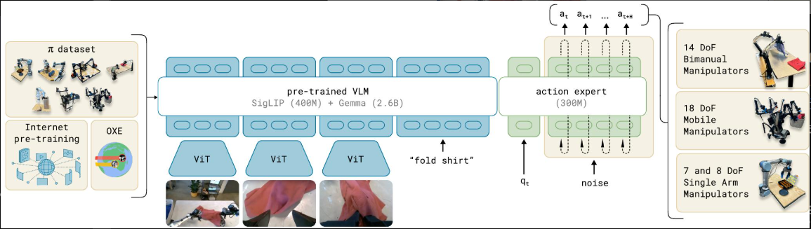

>A human being should be able to change a diaper, plan an invasion, butcher a hog, conn a ship, design a building, write a sonnet, balance accounts, build a wall, set a bone, comfort the dying, take orders, give orders, cooperate, act alone, solve equations, analyze a new problem, pitch manure, program a computer, cook a tasty meal, fight efficiently, die gallantly. Specialization is for insects.

使用这个混合来训练我们的流匹配 VLA 模型，该模型包含一个更大的 VLM 主干和一个更小的动作专家，用于处理机器人状态和动作。VLM 主干权重从 PaliGemma初始化，提供了从大规模互联网预训练中学习到的表示。