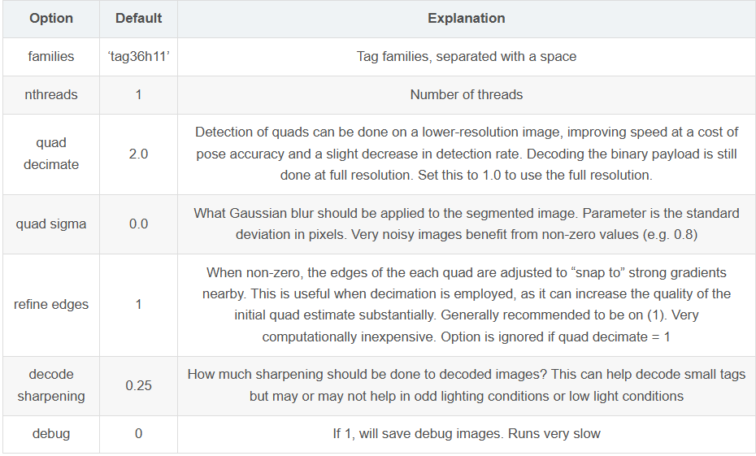
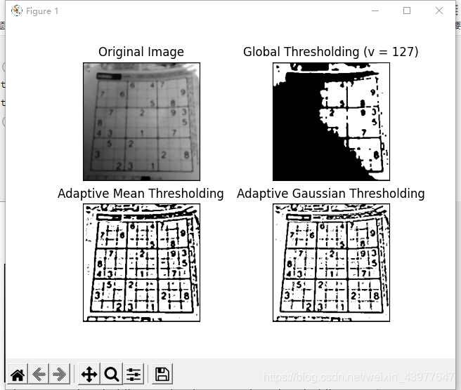
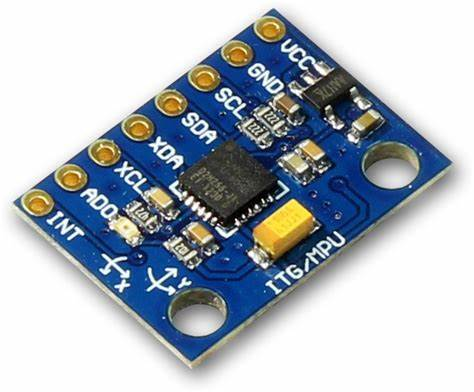

## 形策要做这方面的汇报，记录一下



### 自适应阈值

查了一下，python apriltag库似乎内部识别没有封装自适应阈值，而自适应阈值能减弱光照的影响，这不就有的说了嘛（主打一个没创新硬找）

apriltag使用的是直方图阈值法

### 使用opencv的自适应阈值

```python
def adaptive_threshold_preprocess(image):
    gray = cv2.cvtColor(image, cv2.COLOR_BGR2GRAY)
    # 使用自适应阈值（高斯加权）
    adaptive = cv2.adaptiveThreshold(
        gray, 255,
        cv2.ADAPTIVE_THRESH_GAUSSIAN_C,
        cv2.THRESH_BINARY, 11, 2
    )
    return adaptive

preprocessed = adaptive_threshold_preprocess(image)
detector = apriltag.Detector(families='tag36h11')
results = detector.detect(preprocessed)

```

| **特性**       | **自适应阈值（Adaptive Thresholding）** | **直方图全局阈值（Global Threshold）** |
| :------------- | :-------------------------------------- | :------------------------------------- |
| **计算范围**   | 局部（对每个像素邻域单独计算阈值）      | 全局（对整个图像计算单一阈值）         |
| **光照适应性** | 强（可处理不均匀光照）                  | 弱（依赖图像整体亮度分布）             |

```python
import cv2
import numpy as np
from matplotlib import pyplot as plt

img = cv2.imread('1.png', 0)
img = cv2.medianBlur(img, 5)
ret, th1 = cv2.threshold(img, 127, 255, cv2.THRESH_BINARY)
th2 = cv2.adaptiveThreshold(img, 255, cv2.ADAPTIVE_THRESH_MEAN_C, cv2.THRESH_BINARY, 11, 2)
th3 = cv2.adaptiveThreshold(img, 255, cv2.ADAPTIVE_THRESH_GAUSSIAN_C, cv2.THRESH_BINARY, 11, 2)
titles = ['Original Image', 'Global Thresholding (v = 127)',
          'Adaptive Mean Thresholding', 'Adaptive Gaussian Thresholding']
images = [img, th1, th2, th3]
for i in range(4):
    plt.subplot(2, 2, i + 1), plt.imshow(images[i], 'gray')
    plt.title(titles[i])
    plt.xticks([]), plt.yticks([])
plt.show()
```



### 深度学习

使用预训练模型（如 [EnlightenGAN](https://github.com/VITA-Group/EnlightenGAN)）对输入图像进行光照归一化


整了一个看不大懂的论文，大概就是一个不用强光版本和弱光版本对比的**生成对抗网络**

### 基于卡尔曼滤波的Apriltag+IMU传感器融合识别



MPU6050是一个6轴姿态传感器（3轴[加速度计](https://so.csdn.net/so/search?q=加速度计&spm=1001.2101.3001.7020)和3轴陀螺仪传感器），可以测量芯片自身X、Y、Z轴的加速度、角度参数，通过数据融合，可以得到姿态角

#### **互补性融合目标**

-  **高频IMU**：提供连续运动预测，补偿AprilTag低帧率问题
-  **多AprilTag**：提供全局位姿校正，抑制IMU积分漂移
-  **冗余观测**：通过多标签空间分布增强抗遮挡能力

### 1. 系统建模

#### 1.1 状态空间模型
在二维平面中，系统的状态向量定义为：

$\mathbf{x} = \begin{bmatrix} x \\ y \\ \dot{x} \\ \dot{y} \\ \theta \\ \dot{\theta} \end{bmatrix}$

其中：
- $(x, y)$：二维位置坐标  
- $(\dot{x}, \dot{y})$：线速度  
- $\theta$：偏航角（方向）  
- $\dot{\theta}$：角速度  

---

#### 1.2 运动模型（预测）
IMU 提供加速度 $\mathbf{a} = [a_x, a_y]$ 和角速度 $\dot{\theta}$，离散时间运动模型为：


$\begin{aligned}
x_{k+1} &= x_k + \dot{x}_k \Delta t + \frac{1}{2}a_x \Delta t^2, \\
y_{k+1} &= y_k + \dot{y}_k \Delta t + \frac{1}{2}a_y \Delta t^2, \\
\dot{x}_{k+1} &= \dot{x}_k + a_x \Delta t, \\
\dot{y}_{k+1} &= \dot{y}_k + a_y \Delta t, \\
\theta_{k+1} &= \theta_k + \dot{\theta} \Delta t.
\end{aligned}$

- **状态转移矩阵** $\mathbf{F}$ 和 **过程噪声协方差** $\mathbf{Q}$ 需根据 IMU 噪声特性建模。

---

#### 1.3 观测模型（更新）
AprilTag 提供直接观测：

$\mathbf{z}_{\text{tag}} = \begin{bmatrix} x_{\text{tag}} \\ y_{\text{tag}} \\ \theta_{\text{tag}} \end{bmatrix}$

观测矩阵 $\mathbf{H}$ 将状态映射到观测空间：

$\mathbf{H} = \begin{bmatrix}
1 & 0 & 0 & 0 & 0 & 0 \\
0 & 1 & 0 & 0 & 0 & 0 \\
0 & 0 & 0 & 0 & 1 & 0 \\
\end{bmatrix}$

- **观测噪声协方差** $\mathbf{R}$ 取决于 AprilTag 检测精度。

---

### 2. 卡尔曼滤波流程

#### 2.1 预测步骤
1. **状态预测**：
   
   $\hat{\mathbf{x}}_{k|k-1} = \mathbf{F} \mathbf{x}_{k-1|k-1} + \mathbf{B} \mathbf{u}_k$
   
   （$\mathbf{u}_k$ 为 IMU 输入，$\mathbf{B}$ 为控制矩阵）。

2. **协方差预测**：
   
   $\mathbf{P}_{k|k-1} = \mathbf{F} \mathbf{P}_{k-1|k-1} \mathbf{F}^T + \mathbf{Q}$

---

#### 2.2 更新步骤
当 AprilTag 观测可用时：
1. **卡尔曼增益**：
   
   $\mathbf{K}_k = \mathbf{P}_{k|k-1} \mathbf{H}^T (\mathbf{H} \mathbf{P}_{k|k-1} \mathbf{H}^T + \mathbf{R})^{-1}$
2. **状态更新**：
   
   $\mathbf{x}_{k|k} = \hat{\mathbf{x}}_{k|k-1} + \mathbf{K}_k (\mathbf{z}_k - \mathbf{H} \hat{\mathbf{x}}_{k|k-1})$
3. **协方差更新**：
   
   $\mathbf{P}_{k|k} = (\mathbf{I} - \mathbf{K}_k \mathbf{H}) \mathbf{P}_{k|k-1}$

### **概述**

---

## **1. 预测（Prediction）——基于IMU的运动模型**

**目标**：利用IMU的加速度和角速度数据，预测当前时刻的状态（位置、速度、方向）。  
**核心依赖**：

- **IMU的运动模型**（状态转移方程）  
   - 通过加速度 $ \mathbf{a} = [a_x, a_y] $ 和角速度 $ \dot{\theta} $ 推算位置、速度、方向的变化。  
   - 离散时间模型示例（假设短时间 $ \Delta t $ 内加速度恒定）：
      $$
      \begin{cases}
      x_{k} = x_{k-1} + \dot{x}_{k-1} \Delta t + \frac{1}{2} a_x \Delta t^2 \\
      \dot{x}_{k} = \dot{x}_{k-1} + a_x \Delta t \\
      \theta_{k} = \theta_{k-1} + \dot{\theta} \Delta t \\
      \end{cases}
      $$
- **状态转移矩阵 $ \mathbf{F} $**  
  
   - 描述状态如何随时间演变（线性化模型）。  
- **过程噪声协方差 $ \mathbf{Q} $**  
  
   - 反映IMU的噪声（如加速度计漂移、陀螺仪随机游走）。    

---

## **2. 更新（Update）——基于AprilTag的观测校正**

**目标**：当AprilTag被检测到时，用其提供的绝对位置和方向信息修正预测值。  
**核心依赖**：

- **AprilTag的观测模型**  
   - 直接测量位置 $ (x, y) $ 和方向 $ \theta $：
      $$
      \mathbf{z}_{\text{tag}} = [x_{\text{tag}}, y_{\text{tag}}, \theta_{\text{tag}}]^T
      $$
- **观测矩阵 $ \mathbf{H} $**  
  
   - 将状态向量映射到观测空间（例如 $ \mathbf{H} $ 提取位置和角度）。  
- **观测噪声协方差 $ \mathbf{R} $**  
  
   - 反映AprilTag的检测误差（与标签大小、相机分辨率、距离相关）。  

**更新步骤**：

1. **计算残差**：观测值与预测值的差异 $ \mathbf{z}_k - \mathbf{H} \hat{\mathbf{x}}_{k|k-1} $。  
2. **卡尔曼增益 $ \mathbf{K} $**：权衡预测与观测的信任度（噪声小的传感器权重更高）。  
3. **状态修正**：融合预测和观测，得到最优估计 $ \mathbf{x}_{k|k} $。  

---

## **3. 预测与更新的协同关系**

| 步骤     | 基于传感器 | 频率 | 作用                          | 局限性               |
| -------- | ---------- | ---- | ----------------------------- | -------------------- |
| **预测** | IMU        | 高频 | 提供连续运动估计              | 积分漂移（误差累积） |
| **更新** | AprilTag   | 低频 | 提供绝对位置校正，抑制IMU漂移 | 依赖视野，可能被遮挡 |

**关键点**：

- **预测依赖IMU动力学**，更新依赖AprilTag的几何测量。  
- **卡尔曼滤波通过协方差矩阵 $ \mathbf{Q} $ 和 $ \mathbf{R} $** 动态调整两者权重：  
   - 当AprilTag可信时（$ \mathbf{R} $ 小），更新大幅修正状态。  
   - 当AprilTag不可用时，纯IMU预测短期有效，但需限制持续时间。  


## LaTex公式渲染问题

这数学公式的渲染真奇怪，折腾半天也不行，算了，放弃了/(ㄒoㄒ)/~~，以后有机会再折腾吧

重装了博客，参考[Hexo and KaTeX | ∞](https://jun-wang-2018.github.io/MyBlog/en/hexo-and-katex/)成功渲染了公式，感谢分享，太开心了，还是不太明白，似乎是katex与mathjax重复渲染导致的，虽然\mathbf还是不太行，还但能跑就行，这次整好了就再也不折腾了